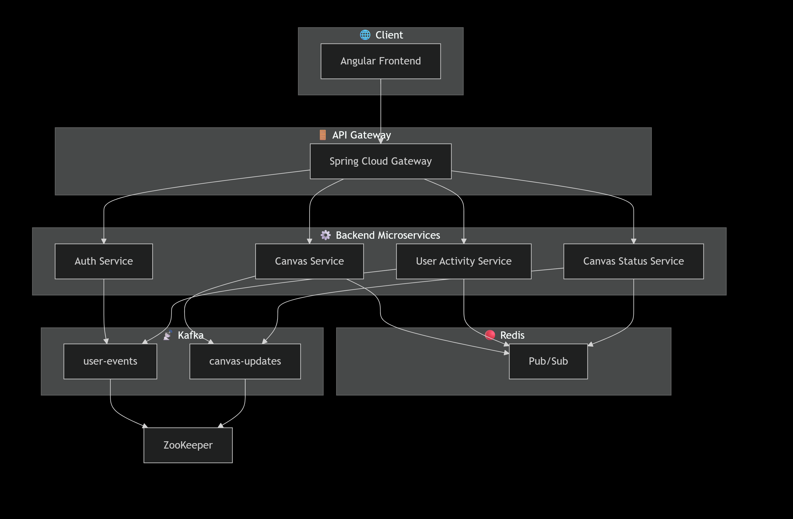

# Pulse Canvas 🖌️✨

**Pulse Canvas** is a **real-time collaborative whiteboard platform** built on a modern microservices architecture.  
It enables multiple users to **draw, collaborate, and interact in real time** with optimized bandwidth usage and scalable event-driven design.

---
<iframe width="560" height="315" src="https://www.youtube.com/embed/p_on2nlB31o?start=69" frameborder="0" allow="accelerometer; autoplay; clipboard-write; encrypted-media; gyroscope; picture-in-picture" allowfullscreen></iframe>##


🚀 Tech Stack

- **Frontend:** Angular 17 (TypeScript, Tailwind, WebSockets integration)  
- **Backend:** Java 17 + Spring Boot microservices  
- **Event Streaming:** Apache Kafka (real-time events)  
- **Real-time Communication:** WebSockets  
- **State Caching:** Redis (shared canvas state)  
- **Service Mesh / Routing:** Spring Cloud Gateway + Load Balancer  
- **Authentication:** JWT / OAuth2 integrated Auth Service  
- **Deployment:** Docker + Docker Compose (full stack orchestration)  
- **Architecture:** Event-Driven Microservices  

---

## 🎥 Demo

Here’s a short demo video of **Pulse Canvas** in action:  

[](https://www.youtube.com/watch?v=VIDEO_ID)  

*(Replace `VIDEO_ID` with your actual YouTube video link. If you want to embed a local demo GIF instead, add it under `/docs/demo.gif` and link it here.)*

---

## 🏗️ Architecture


The system follows a **modular microservices architecture** with Kafka-driven communication and Redis for fast in-memory state sharing.

### 🛠️ Services Overview

- **Auth Service** → Handles authentication (JWT/OAuth2), sessions, and user identity.  
- **Canvas Service** → Core drawing service (WebSockets + Kafka + Redis). Optimized for memory and bandwidth.  
- **User Activity Service** → Tracks connected users, join/leave events, and active session management.  
- **Canvas Status Service** → Provides real-time previews, metadata, and trending canvases.  
- **Redis** → Fast in-memory store for shared canvas state across instances.  
- **Kafka** → Reliable event streaming backbone for collaboration events.  

---

## ⚡ Optimizations

Pulse Canvas is designed to scale efficiently with many simultaneous collaborators:  

- **Bandwidth optimization** → RGBA data combined into a single compact payload stream.  
- **Memory efficiency** → Canvas Service tuned for reduced memory consumption (object pooling, serialization optimization).  
- **Parallel event handling** → Kafka + ForkJoinPool for scalable event distribution.  

---
🔧 Areas of Improvement

While Pulse Canvas is fully functional, there are several areas where the platform can be enhanced to improve performance and user experience:

Memory Consumption → Further optimization of the Canvas Service to reduce memory usage, especially with large or multiple simultaneous canvases.

User Interaction Features → Adding richer collaboration tools such as comments, reactions, and real-time annotations.

User Invitation Feature → Implementing a system to invite users to specific canvases or sessions, with roles and permissions.
---

## 🐳 Running with Docker

You can run the **entire stack locally** using Docker Compose.

### Prerequisites
- Docker & Docker Compose installed  
- Java 17 and Node.js (for local builds if needed)  

### Steps

```bash
# Clone repository
git clone https://github.com/mohamedamine585/pulse-canvas.git
cd pulse-canvas

# Build backend services
mvn clean install -DskipTests

# Build frontend
cd frontend
npm install
npm run build
cd ..

# Run the whole stack
docker-compose up --build
